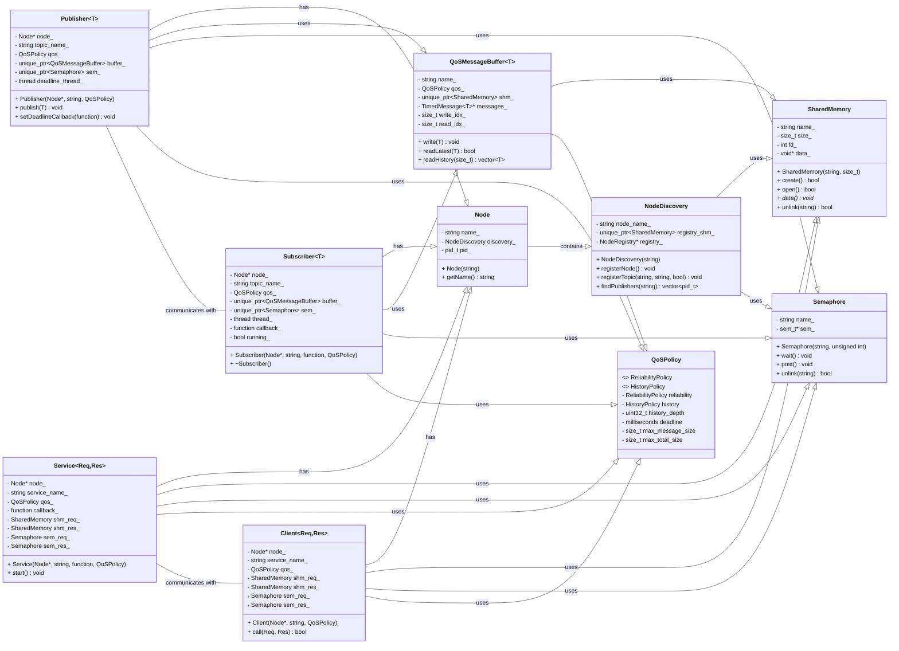

# miniROS2

## 项目简介

miniROS2 是一个轻量级的机器人操作系统通信框架，基于 POSIX 共享内存实现高效的进程间通信。该框架参考了 ROS2（Robot Operating System 2）的核心概念，但采用更简洁的设计，适用于资源受限的嵌入式系统和需要高性能通信的场景。

### 核心特性

- **基于共享内存的高效通信**：使用 POSIX 共享内存实现低延迟、高带宽的进程间通信
- **发布-订阅模式**：支持松耦合的消息传递机制
- **服务-客户端模式**：支持请求-响应式通信
- **事件通知机制**：基于条件变量和互斥锁实现高效的事件触发
- **节点发现**：支持节点自动发现和注册
- **JSON 消息序列化**：使用 JSON 格式进行灵活的数据序列化
- **定时器功能**：支持周期性任务调度
- **线程池优化**：使用线程池处理异步任务
- **可配置的 QoS 策略**：支持消息可靠性、历史深度等服务质量配置

## 系统架构

miniROS2 采用多层架构设计，从底层到上层依次为：

1. **共享内存层**：提供基础的共享内存访问和管理
2. **通信适配器层**：处理不同通信方式的适配
3. **节点和发现层**：管理节点生命周期和服务发现
4. **发布订阅层**：实现消息发布和订阅功能
5. **服务客户端层**：实现请求响应式通信
6. **应用层**：用户应用程序

### 类图关系



## 安装与构建

### 环境要求

- Linux 操作系统（支持 POSIX 共享内存）
- C++17 兼容的编译器
- CMake 3.10 或更高版本

### 构建步骤

1. 克隆仓库
```bash
git clone <repository_url>
cd miniROS2
```

2. 使用提供的构建脚本
```bash
./build.sh
```

3. 手动构建（可选）
```bash
mkdir -p build
cd build
cmake ..
make
```

## 快速开始

### 基本概念

- **节点(Node)**：miniROS2 中最小的执行单元，类似于进程
- **话题(Topic)**：消息传递的通道，使用发布-订阅模式
- **发布者(Publisher)**：发布消息到话题的节点组件
- **订阅者(Subscriber)**：从话题接收消息的节点组件
- **服务(Service)**：提供请求-响应式通信的组件
- **客户端(Client)**：调用服务的组件
- **事件(Event)**：用于触发通知的机制

### 使用示例

#### 1. 发布者示例

```cpp
#include "mini_ros2/communication/shm_base.h"
#include "mini_ros2/message/json.h"
#include "mini_ros2/node.h"
#include "mini_ros2/pubsub/publisher.h"
#include "time.h"

int main() {
  // 创建节点
  Node node("test_node2");
  
  // 创建发布者，使用JsonValue类型的消息
  auto pub = node.createPublisher<JsonValue>("test");
  auto pub1 = node.createPublisher<JsonValue>("test");
  
  // 创建1000ms定时器，定时发布消息
  node.createTimer(1000, [&pub, &pub1]() {
    // 构建JSON消息
    JsonValue json;
    json["name"] = "John";
    json["age"] = 30;
    json["city"] = "New York";
    json["is_student"] = true;
    json["height"] = 1.8;
    json["weight"] = 70;
    json["time"] = std::to_string(static_cast<uint64_t>(time(nullptr)));

    JsonValue json1;
    json1["name"] = "Bod";
    json1["age"] = 10;
    json1["city"] = "LA";
    json1["is_student"] = false;
    json1["height"] = 1.2;
    json1["weight"] = 40;
    json1["time"] = std::to_string(static_cast<uint64_t>(time(nullptr)));
    
    // 发布消息
    pub->publish("test", json);
    pub1->publish("test1", json1);
  });
  
  // 打印注册表信息
  node.printRegistry();
  
  // 启动节点，开始处理事件和定时器
  node.spin();
  
  return 0;
}
```

#### 2. 订阅者示例

```cpp
#include "mini_ros2/communication/shm_base.h"
#include "mini_ros2/message/json.h"
#include "mini_ros2/node.h"
#include "mini_ros2/pubsub/subscriber.h"

int main() {
  // 创建节点
  Node Node("test_node2");
  
  // 创建订阅者，监听"test"话题的"test"事件
  auto sub = Node.createSubscriber<JsonValue>(
      "test", "test", [](const JsonValue& data) {
        std::cout << "Received: " << data.serialize() << std::endl;
      });
  
  // 创建另一个订阅者，监听"test"话题的"test1"事件
  auto sub1 = Node.createSubscriber<JsonValue>(
      "test", "test1", [](const JsonValue& data) {
        std::cout << "Received1: " << data.serialize() << std::endl;
      });
  
  // 打印注册表信息
  Node.printRegistry();
  
  // 启动节点，开始接收消息
  Node.spin();
  
  return 0;
}
```

#### 3. 直接使用共享内存（底层API示例）

```cpp
// 创建共享内存
ShmBase shm("/test_sem", 1024);
shm.Create();

// 写入数据
while (true) {
  uint64_t cur_time = static_cast<uint64_t>(time(nullptr));
  JsonValue json;
  json["name"] = "John";
  json["age"] = 30;
  
  std::string json_str = json.serialize();
  shm.Write(json_str.c_str(), strlen(json_str.c_str()) + 1);
  
  sleep(1); // 每秒写入一次
}

// 读取数据（在另一个进程中）
ShmBase shm_read("/test_sem", 1024);
shm_read.Open();

while (true) {
  char data[1024];
  shm_read.Read(data, 1024);
  JsonValue json = JsonValue::deserialize(data);
  std::cout << "Received: " << json.serialize() << std::endl;
  
  sleep(1); // 每秒读取一次
}
```

## 核心组件详解

### 1. 共享内存管理

#### SharedMemory 类
- **功能**：封装 POSIX 共享内存操作，提供创建、打开、关闭和删除共享内存的功能
- **主要方法**：
  - `Create()`: 创建新的共享内存区域
  - `Open()`: 打开已存在的共享内存区域
  - `Close()`: 关闭共享内存
  - `Unlink()`: 删除共享内存
  - `Data()`: 获取指向共享内存数据的指针

#### ShmBase 类
- **功能**：在 SharedMemory 基础上增加了互斥锁和条件变量，提供线程安全的读写操作
- **主要方法**：
  - `Write()`: 线程安全地写入数据
  - `Read()`: 线程安全地读取数据
  - `WriteUnlocked()`: 假设已持有锁的情况下写入数据
  - `ReadUnlocked()`: 假设已持有锁的情况下读取数据

### 2. 节点系统

#### Node 类
- **功能**：miniROS2 的核心类，代表一个通信节点，管理发布者、订阅者和定时器
- **主要方法**：
  - `createPublisher<T>()`: 创建指定类型的发布者
  - `createSubscriber<T>()`: 创建指定类型的订阅者
  - `createTimer()`: 创建定时器
  - `spin()`: 启动节点事件循环
  - `stop()`: 停止节点事件循环

### 3. 发布-订阅系统

#### Publisher\<T\> 类
- **功能**：发布指定类型的消息到话题
- **模板参数**：T - 消息类型
- **主要方法**：
  - `publish()`: 发布消息

#### Subscriber\<T\> 类
- **功能**：订阅话题并接收消息
- **模板参数**：T - 消息类型
- **主要方法**：
  - 构造函数接收回调函数，当收到消息时会调用该函数

### 4. 消息系统

#### JsonValue 类
- **功能**：提供 JSON 数据的序列化和反序列化功能
- **主要方法**：
  - `serialize()`: 将 JSON 对象序列化为字符串
  - `deserialize()`: 从字符串反序列化为 JSON 对象
  - 操作符重载用于访问和设置 JSON 字段

### 5. 事件通知

#### EventNotificationShm 类
- **功能**：基于共享内存实现进程间事件通知
- **主要方法**：
  - `waitForEvent()`: 等待事件触发
  - `readEvents()`: 读取当前事件标志
  - `triggerEvent()`: 触发事件

## 高级特性

### 1. 定时器功能

miniROS2 提供了定时器功能，可以定期执行回调函数。定时器基于线程池实现，避免了为每个定时器创建单独的线程。

### 2. 服务质量 (QoS) 策略

支持配置消息的服务质量参数，包括：
- 可靠性策略
- 历史记录深度
- 截止时间
- 最大消息大小

### 3. 线程池优化

使用线程池处理异步任务和回调，提高系统性能和资源利用率。

## 常见问题与解决方案

### 1. 共享内存残留

如果程序异常退出，可能会导致共享内存残留。可以使用以下命令清理：

```bash
./clear_shm.sh
```

或者手动清理：

```bash
ipcs -m | grep miniros2 | awk '{print $2}' | xargs -I {} ipcrm -m {}
```

### 2. 节点退出问题

如果节点在 Ctrl+C 后无法正常退出，可以检查信号处理和资源释放逻辑。确保调用了 `node.stop()` 方法来正确清理资源。

### 3. 死锁问题

在使用共享内存时，需要注意锁的获取顺序，避免循环等待导致死锁。特别是在定时器回调中使用发布功能时，需要确保锁的使用是安全的。

## 许可证

[在此添加许可证信息]

## 贡献指南

欢迎提交问题报告和功能请求。如有兴趣贡献代码，请遵循以下步骤：

1. Fork 本仓库
2. 创建功能分支
3. 提交更改
4. 创建 Pull Request

## 联系方式

[在此添加项目维护者的联系方式]